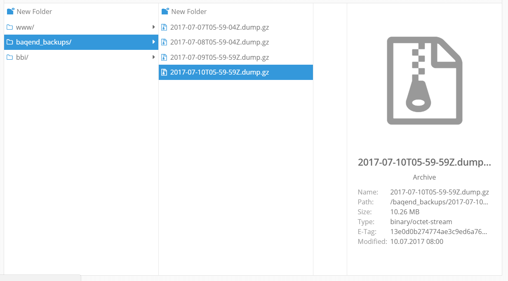

# Backups

To minimize the risk of data loss through hardware failure, Baqend stores all your data in a **threefold replicated** cluster spanning multiple availability zones. To also shield you against human or other errors that may result in data loss, Baqend makes periodic backups which you can import into any off-the-shelf MongoDB database. 

## Periodic Backups 

Baqend automatically creates weekly backups for Indie apps and daily backups for higher plans, every morning at 6 AM (UTC). 
Every backup is a downloadable MongoDB dump archive located in the `baqend_backups/` file directory. 
The used backup storage will be charged like normal file storage. 
By default, the MongoDB backups will be retained for 30 days before they are removed. 
If you prefer a custom retention period, contact us via mail at [support@baqend.com](mailto:support@baqend.com) or via chat.

## Restoring Data from a Backup

Baqend does not allow resetting your cloud-hosted app database to the exact state of a backup file, because resetting database state might override modifications that took place after the backup had been taken.  
To make sure this doesn't happen, the recovery procedure lets you (1) restore the backup file to a Baqend instance local to your machine, (2) export relevant data from the restored local instance and (3) import the lost data to your cloud-hosted app database. 

The following step-by-step guide describes how to recover lost data from a backup file:

1. Download all required tools

    - Download and install MongoDB from the official [MongoDB download page](https://www.mongodb.com/download-center#community) 
      or by using the package manager of your OS. Make sure to use the *official* MongoDB installation, because it contains the [mongorestore](https://docs.mongodb.com/manual/reference/program/mongorestore/) 
      command which is required for the recovery procedure. Also make sure to install MongoDB version 3.4 or higher.
    - Download the latest Baqend Community Editon from our [download page](https://www.baqend.com/product.html#download).
    - Install the Baqend CLI tool as described in the [Baqend CLI](../cli/) guide section.
    

2. Start you local Baqend Server (Community Edition)

    - Remove the `state.json` file from the `data` directory to remove any pre-installed tables from the Community Edition.
    - Start a local Baqend instance by launching the `baqend.bat` or `baqend.sh` script. 
    - A local version of the Dashboard should open automatically ([http://localhost:8080/v1/dashboard](http://localhost:8080/v1/dashboard)). 
    - Enter the Dashboard by entering the username `root` and the password `root`
    

3. Copy your Baqend App Schema 
    
    Now use the Baqend CLI tool to copy the Baqend Schema from your cloud-hosted Baqend app into your local Baqend server:
    
    First, you will download your app schema from the cloud-hosted Baqend instance. To this end, create a new directory, open a shell, type the following command and press enter: 
    <pre><code class="bash">baqend schema download &lt;appName&gt;</code></pre>
    
    When prompted, provide your Baqend account credentials. 
    
    Now, you'll upload the schema to your local Baqend instance:
    
    <pre><code class="bash">baqend schema upload http://localhost:8080/v1</code></pre>
    
    When prompted, provide the default user credentials (username `root` and password `root`).
    
    Reload The dashboard. You should see your custom data collections now.
    

4. Get the latest MongoDB Backup

    - Open the [Baqend Dashboard](https://dashboard.baqend.com/apps).
    - Enter your app and open the `baqend_backups/` directory in the *File Explorer*.
    - Download the backup file you want to recover data from.
    
    
    

5. Restore the MongoDB Backup

    Enter your MongoDB backup download directory and enter the following command:
    
    <pre><code class="bash">mongorestore --gzip --archive=&lt;archiveDate&gt;Z.dump.gz --nsFrom &lt;appName&gt;.\* --nsTo local.\*
    </code></pre>

    This will import your backup data into the `local` database which is the default database for the Community Edition.
    If you get an error explaining that `mongorestore` is an unknown command, ensure that the `mongorestore` binary is on your `PATH` and try again. (Alternatively, you can also use the fully specified command `path/to/mongorestore`.)
    
    Reload the dashboard of your local instance again. The recovered data should appear. 
    You can now export individual objects or entire collections from your local Baqend app and then import them into your cloud-hosted app using the [export and import](../crud/#exporting-and-importing-tables) functionality.

 